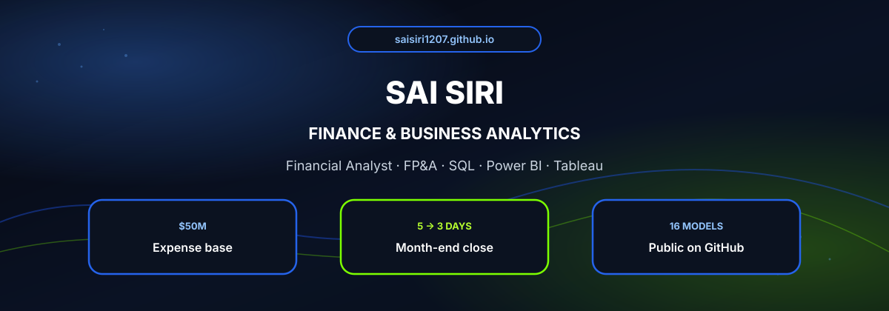
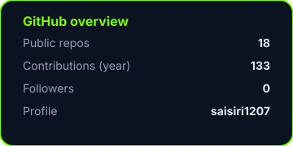

  

 

  Currently a **Financial Analyst** at **PNC Financial Services** (Operations Finance / FP&A).  
  I build executive KPI dashboards, SQL driven variance analysis, and forecasting models across a **$50M** expense base.

  **Stack** · SQL · Power BI (DAX) · Tableau · Python (pandas) · R · Excel  
  **Education** · MS Business Analytics (Beta Gamma Sigma), University of New Haven · MBA Accounting & Finance

  
  
  
  

---

  
  &nbsp;&nbsp;
  

 

  
  

---

## Selected projects

### Dashboards & reporting
| Project | Repo |
| --- | --- |
| Power BI sales dashboard | [northline sales powerbi dashboard](https://github.com/saisiri1207/northline-sales-powerbi-dashboard) |
| Monthly KPI scorecard | [monthly kpi scorecard](https://github.com/saisiri1207/monthly-kpi-scorecard) |
| Variance dashboard | [fpna variance dashboard](https://github.com/saisiri1207/fpna-variance-dashboard) |
| Working capital dashboard | [working capital dashboard](https://github.com/saisiri1207/working-capital-dashboard) |
| Board / ELT flash pack | [board elt flash](https://github.com/saisiri1207/board-elt-flash) |

### Forecasting & modeling
| Project | Repo |
| --- | --- |
| Driver based forecast | [driver based forecast](https://github.com/saisiri1207/driver-based-forecast) |
| Three statement model | [three statement model](https://github.com/saisiri1207/three-statement-model) |
| DCF valuation | [dcf valuation model](https://github.com/saisiri1207/dcf-valuation-model) |
| Scenario planning pack | [scenario planning pack](https://github.com/saisiri1207/scenario-planning-pack) |
| Headcount and staffing forecast | [headcount staffing forecast](https://github.com/saisiri1207/headcount-staffing-forecast) |

### Unit economics & cost
| Project | Repo |
| --- | --- |
| Margin and mix bridge | [margin mix bridge](https://github.com/saisiri1207/margin-mix-bridge) |
| Unit economics workbook | [unit economics workbook](https://github.com/saisiri1207/unit-economics-workbook) |
| Cost accounting workbook | [cost accounting workbook](https://github.com/saisiri1207/cost-accounting-workbook) |
| CAPEX investment case | [capex investment case](https://github.com/saisiri1207/capex-investment-case) |
| OPEX / ZBB pack | [opex zbb pack](https://github.com/saisiri1207/opex-zbb-pack) |

---

## Experience

| Role | Company | Period | Focus |
| --- | --- | --- | --- |
| Financial Analyst, Ops Finance / FP&A | PNC Financial Services | Jun 2025 to Present | KPI dashboards, SQL variance, month end close 5→3 days |
| Financial Analyst | upGrad | Apr 2022 to Jul 2023 | Power BI / Tableau, BvA, tuition forecasting, NPV / IRR |
| Sales Analyst | BYJU'S | Aug 2020 to Mar 2022 | Monthly MIS, pricing models, ROI / payback |
| Junior Financial Analyst | BSNL | Jan 2019 to Aug 2019 | SAP / Oracle BvA, EBITDA and leverage MIS |

---

  

